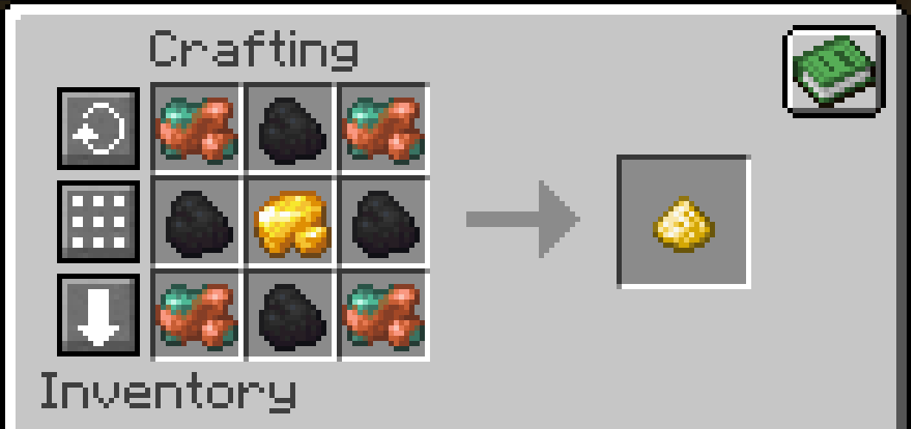
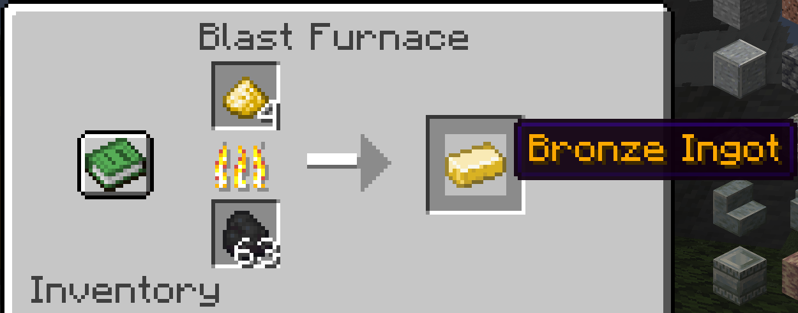
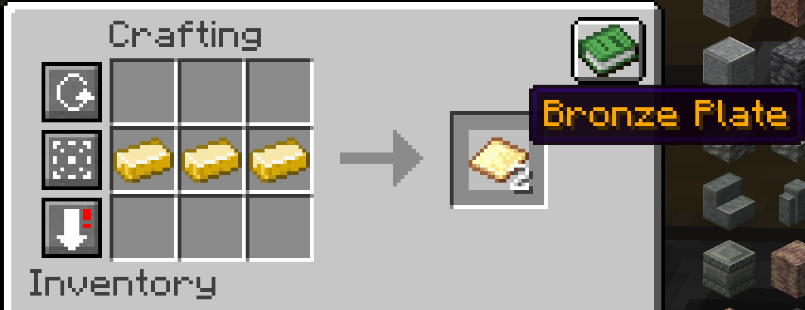
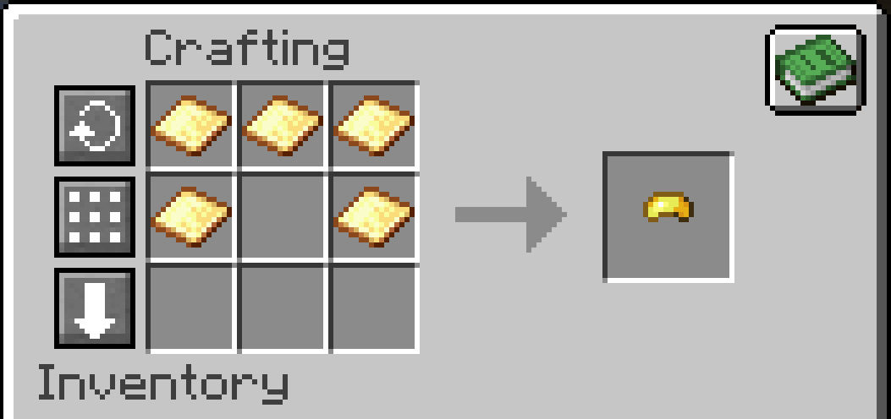
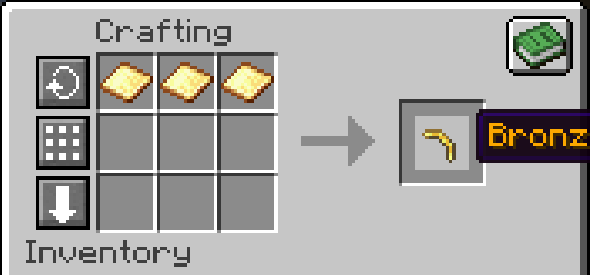
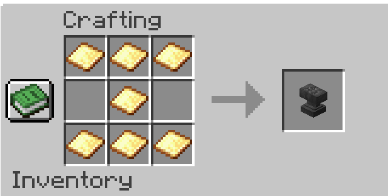
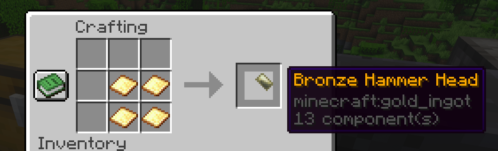

# Bronze!

Bronze has been added to Minecraft! It is made from an alloy of copper and gold, as seen below:

When smelted, it will create a Bronze Ingot

3 Bronze Ingots are used to craft a Bronze Plate

Bronze Plates can be used how you would expect to use an ingot in vanilla Minecraft. The plugin has adjusted armor crafting, so here is an example of crafting the Bronze Helm item, which is used for crafting the Bronze Helmet 

And here is an example of crafting a tool head:

**Note: the tools are equivalent to iron, and the armor is equivalent to chainmail.**

