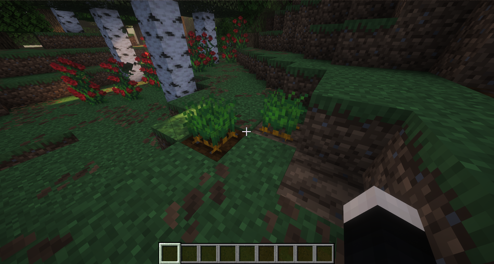
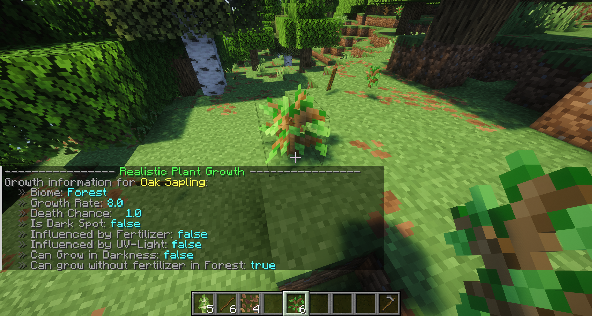
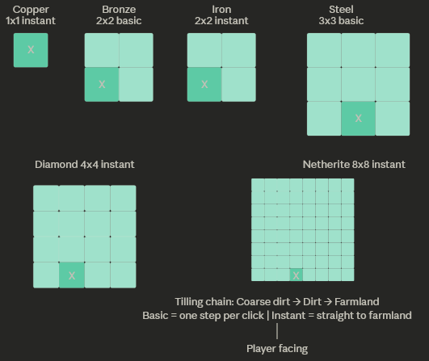

# Farmer

Everything about the Farmer class is the same as the [Farmer class in CivLabs Wiki](https://wiki.civlabs.org/books/plugin-info/page/farmer) (External link) except for the following changes:

# Biome Dependant Crops

Crops will grow only in their exclusive biomes. If they appear in the biome like this example, it is an indicator of it being the most suitable biome for the crop.

Crops, including saplings, need to be exposed to light in order to grow. You can check the growth info by left clicking with the plant in your hand.

## Hoes

You need to use Hoes to harvest crops, otherwise crops will always have a failed harvest.

Review the image below to see how hoes function on our server.
