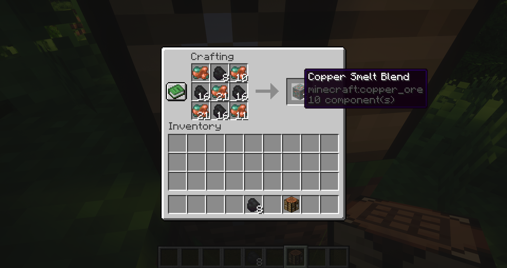

# Ore Processing Overhaul

All minerals have a new recipe for creating a smelting blend. You can no longer just put ores into a furnace and get ingots. This example shows a copper blend being crafting. When this is put into a furnace, a copper ingot it created.

