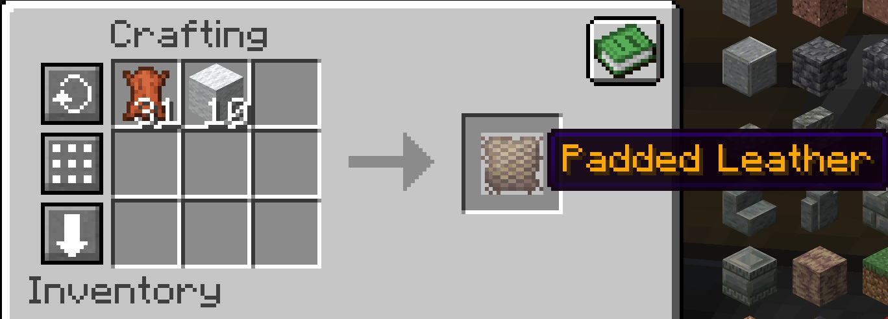

# Padded Leather

A new blacksmithing material has been added (Civlabs players know it):

Padded Leather!

It's essential for crafting any form of Armor. To start, craft the following recipe of wool + leather:

