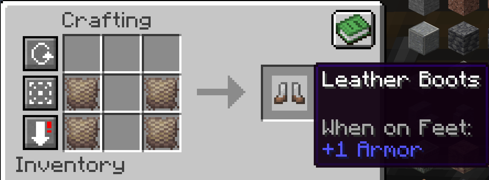
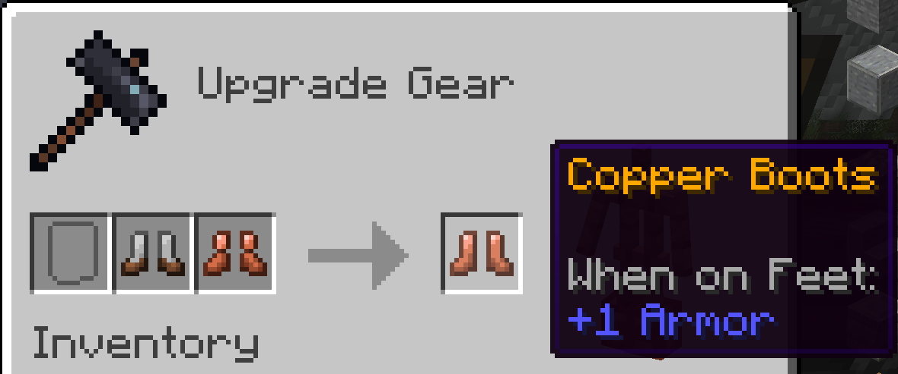

# Padded Leather

A new blacksmithing material has been added (Civlabs players know it):

Padded Leather!

It's essential for crafting any form of Armor. To start, craft the following recipe of wool + leather:

Then, use Padded Leather to craft your usual Leather Armors (example of leather boots):

Combine the Leather Armor with the Metal Armor Template in the Smithing Table:

For information on how to craft Copper, Chainmail, and Bronze Armor Templates, please see the Bonze! thread.