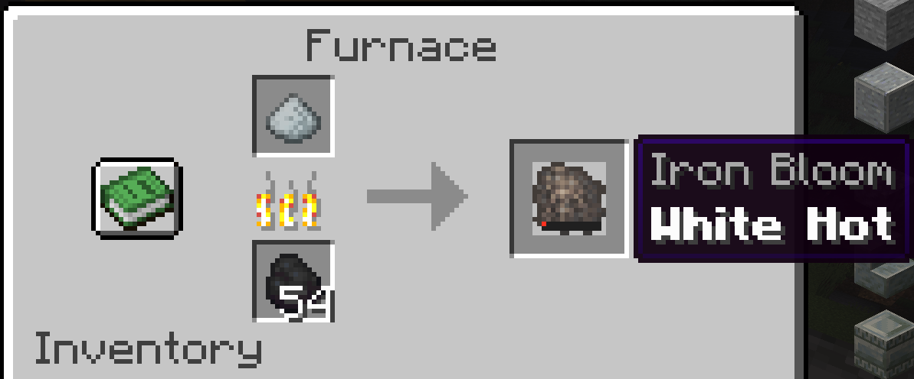
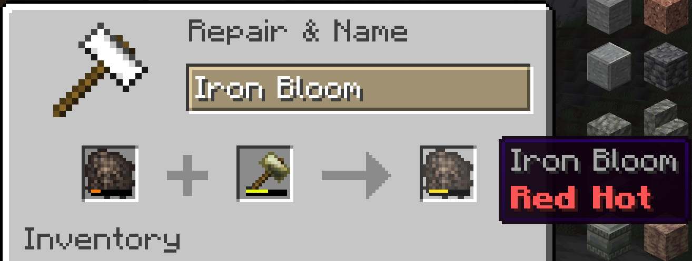
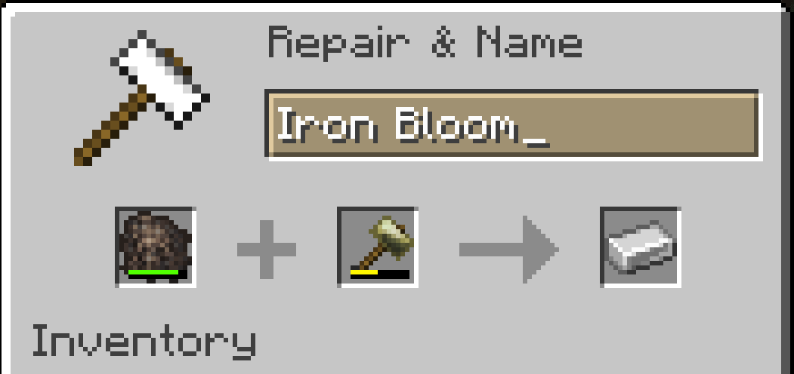
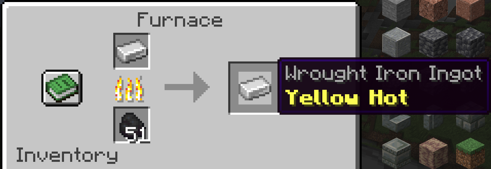
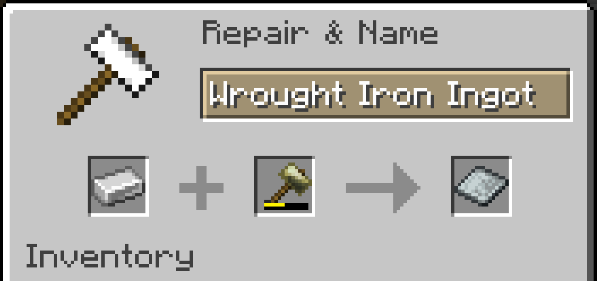
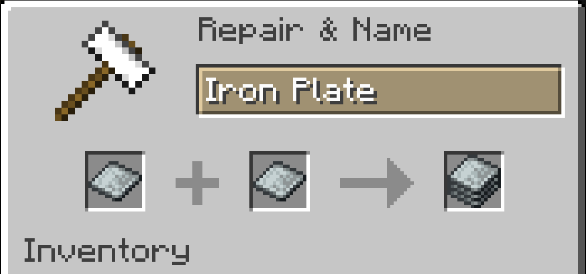

# Smithing

We are implementing a crafting overhaul for blacksmiths once they attain L3 and get access to iron. The intent of this overhaul is to make crafting more immersive. As a bonus, this yields 50% more iron plate sets than the civlabs event 5 plugin. Here are the new recipes:

The smithing takes place in the anvil, see bronze for an anvil recipe

To craft an iron ingot, strike the bloom in an anvil. The bloom will lose heat after each strike, or if it sits in a cold inventory for too long

To heat it, simply put it in a furnace for a reheat

Once you have your ingot, you will need to convert it into plate, then plate set.

Plate set is made by combining two heated plates

Plate sets are used for armor and tool crafting